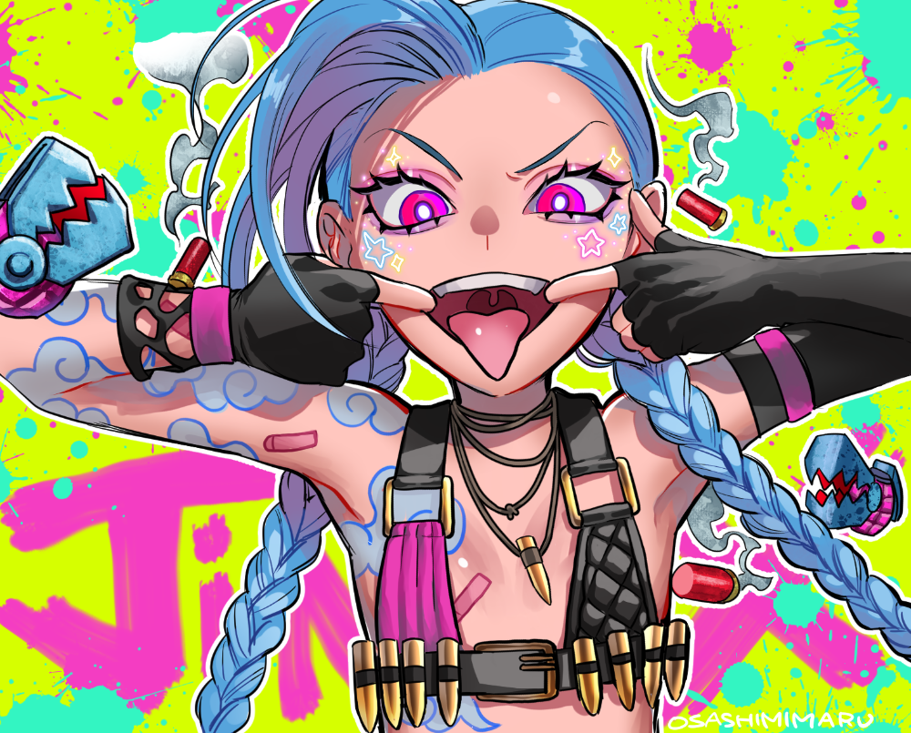

  

<h1 align="center">Hi, I'm <a href="https://vk.com/filin_cprt">filin_cprt</a>!</h1>
<h1 align="center">Welcome to my GitHub profile~ OwO</h1>

  

  <strong><a href="https://vk.com/filin_cprt">VK</a></strong> |
  <strong><a href="https://t.me/filin_cprt">Telegram</a></strong> |
  <strong><a href="https://discordapp.com/users/631824453466062859/">Discord</a></strong> |
  <strong><a href="https://linktr.ee/filin_cprt">Others social</a></strong> |

❤ I'm currently studying Information Systems and Programming, I like music and streaming.

<!--
**edisonlee55/edisonlee55** is a ✨ _special_ ✨ repository because its `README.md` (this file) appears on your GitHub profile.

Here are some ideas to get you started:

- 🔭 I’m currently working on ...
- 🌱 I’m currently learning ...
- 👯 I’m looking to collaborate on ...
- 🤔 I’m looking for help with ...
- 💬 Ask me about ...
- 📫 How to reach me: ...
- 😄 Pronouns: ...
- ⚡ Fun fact: ...
-->
